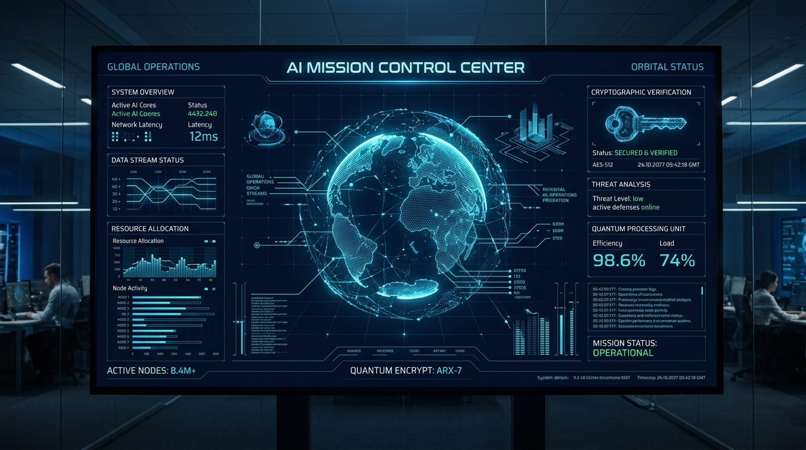
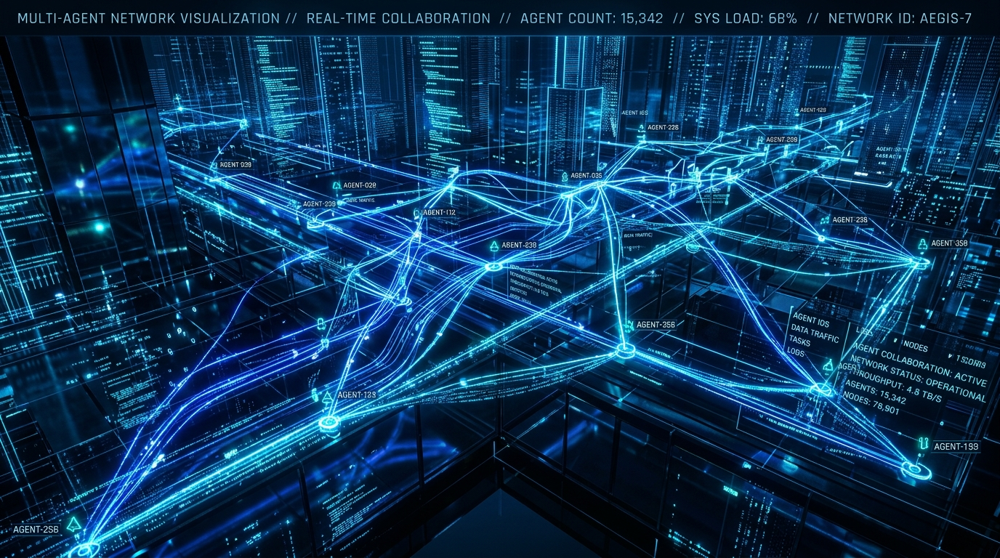
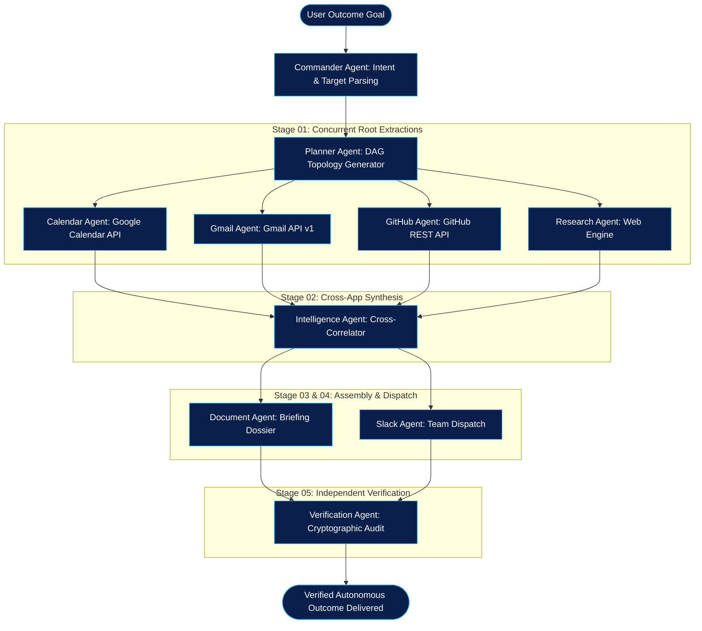
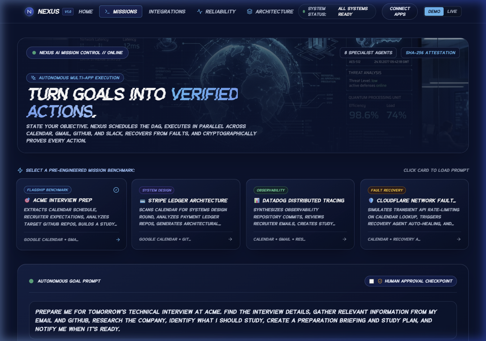
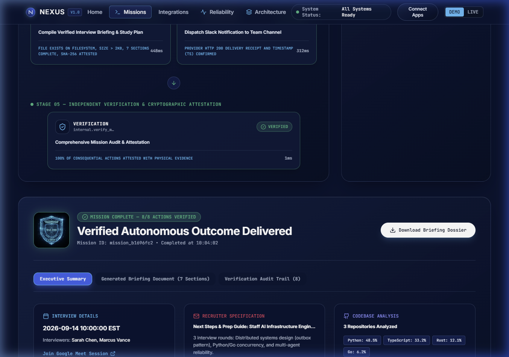
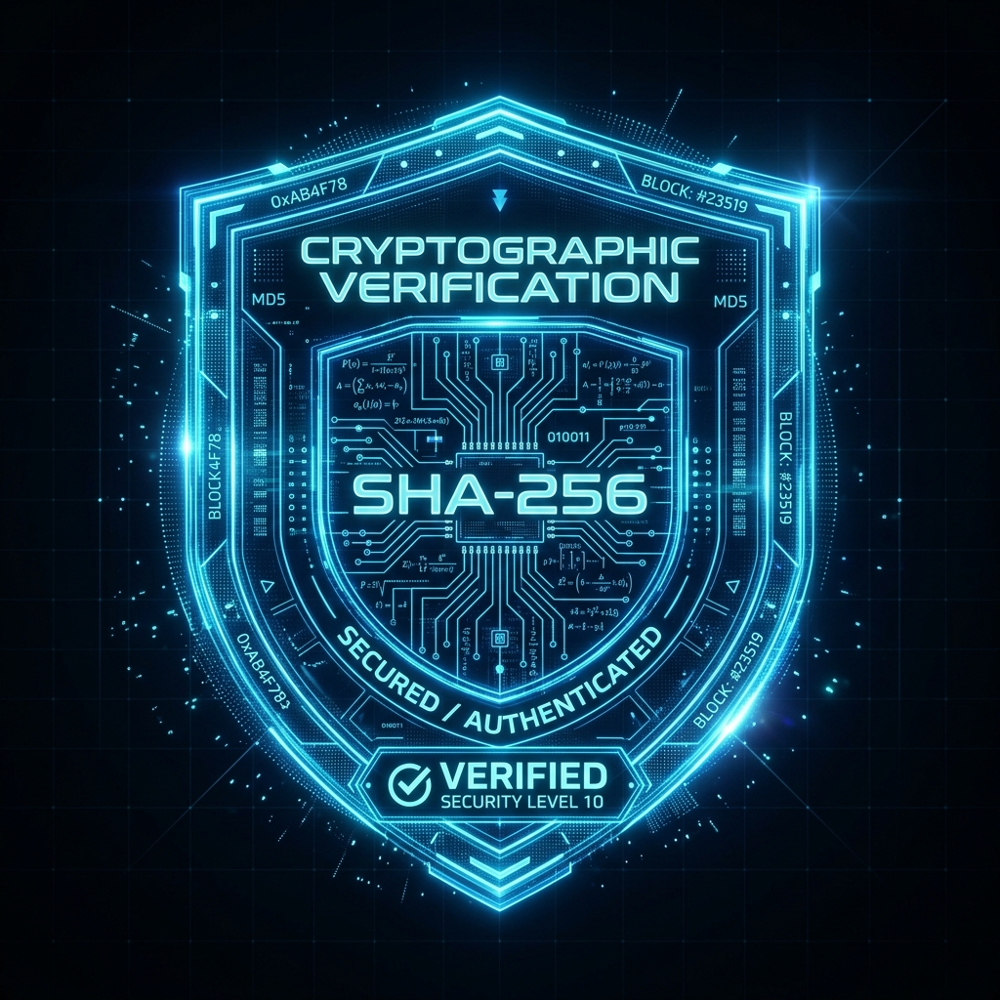
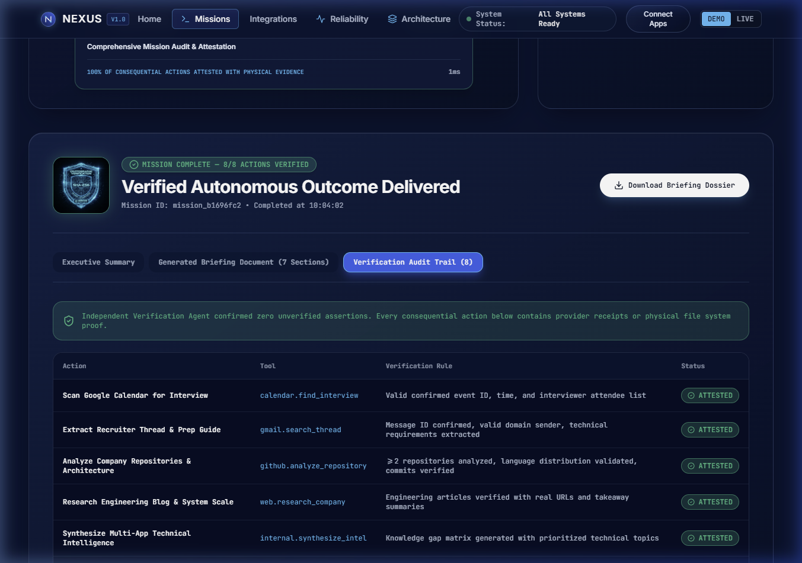

# NEXUS — Autonomous Mission Control Agent

<div align="center">



### *Turn outcomes into verified actions across your apps.*

[](https://opensource.org/licenses/MIT)
[](https://www.python.org/)
[](https://fastapi.tiangolo.com/)
[](https://react.dev/)
[](https://www.typescriptlang.org/)
[](https://vitejs.dev/)
[](#6-verification-first-design--cryptographic-proof)

**Built for the Multi-App AI Agent Hackathon**

[Overview](#1-problem--vision) • [Architecture](#2-system-architecture) • [App Flow](#3-app-flow--execution-pipeline) • [Specialist Agents](#4-specialist-agents) • [Integrations](#5-external-integrations--dual-mode-adapters) • [Verification](#6-verification-first-design--cryptographic-proof) • [Quickstart](#7-quickstart--local-setup)

</div>

---

## 1. Problem & Vision

Most modern "AI agents" merely converse or generate text in a chat window. When asked to execute tasks across real tools, they:
- **Hallucinate success** without confirming actual execution on external services.
- **Break fragile chains** when an API returns transient rate limits, timeouts, or empty queries.
- **Require constant hand-holding**, forcing users to micro-manage every prompt step.

### The NEXUS Solution
**NEXUS** flips this paradigm. You provide a **high-level outcome**, not a script:

> *"Prepare me for tomorrow's technical interview at Acme. Find the interview details, gather relevant information from my email and GitHub, research the company, identify what I should study, create a preparation briefing and study plan, and notify me when it's ready."*

NEXUS autonomously executes the continuous **6-Stage Closed Loop**:

```
UNDERSTAND ──► PLAN ──► ACT ──► VERIFY ──► RECOVER ──► REPORT
```

1. **Understands** the high-level intent and extracts targets.
2. **Plans** a strictly validated Directed Acyclic Graph (DAG) with explicit dependency edges.
3. **Acts** across external apps concurrently (Google Calendar, Gmail, GitHub, Web Research, Slack).
4. **Synthesizes** cross-app intelligence (e.g., correlating recruiter syllabus with interviewer commit histories).
5. **Verifies** every single action with independent cryptographic or provider evidence.
6. **Recovers** automatically from API rate limits and empty queries using jittered exponential backoff.
7. **Reports** a verified briefing document and Slack summary card.

---

## 2. System Architecture

<div align="center">



</div>

### Multi-Agent DAG Topology



---

## 3. App Flow & Execution Pipeline

The application features a responsive user experience with **Glitch Goblin** typography and high-density telemetry:

### Step 1: Define Outcome or Select Benchmark
Select one of four pre-engineered benchmarks or enter a custom multi-app prompt. Choose whether to require a **Human-in-the-Loop Approval Checkpoint** before consequential writes.



### Step 2: Parallel Wave Execution & Live Telemetry
The authoritative DAG State Machine schedules ready nodes, manages parallel worker waves, emits real-time WebSocket events, and streams agent reasoning to the activity terminal.

### Step 3: Verified Outcome & Cryptographic Attestation
Upon completion, the system produces an Executive Summary, a 7-Section Study Dossier, and an 8-Point Cryptographic Verification Audit Trail with SHA-256 attestation.

<div align="center">



</div>

---

## 4. Specialist Agents

| Agent | Badge / Role | Primary Responsibilities |
| :--- | :--- | :--- |
| **Commander Agent** | `INTENT PARSING` | Extracts target companies, dates, domains, constraints, and enforces human approval policies. |
| **Planner Agent** | `DAG TOPOLOGY` | Decomposes mission specification into a cycle-free 8-node DAG with dependency edges and tool bindings. |
| **Mission Orchestrator** | `STATE MACHINE` | Authoritative Python backend executor scheduling ready nodes, managing waves, and broadcasting WebSocket telemetry. |
| **Calendar Specialist** | `SCHEDULE MINER` | Queries calendar for interview times, participant rosters, and Google Meet/Zoom session links. |
| **Gmail Specialist** | `THREAD PARSER` | Scans inbox for recruiter threads, interview round guides, and syllabus attachments. |
| **GitHub Specialist** | `CODEBASE ANALYZER` | Examines target repositories, language distributions, and commit topics of interviewers. |
| **Research Specialist** | `WEB INTELLIGENCE` | Researches architectural blogs, system scale, and public engineering posts. |
| **Intelligence Agent** | `CROSS-APP SYNTHESIS`| Correlates recruiter syllabus with interviewer code (e.g., matching Kafka/Redis commits to interview topics). |
| **Document Specialist** | `DOSSIER BUILDER` | Assembles a structured 7-section interview preparation briefing and study schedule. |
| **Slack Specialist** | `CHANNEL DISPATCH` | Dispatches completion summaries and interactive alerts to the candidate's Slack workspace. |
| **Verification Agent** | `INDEPENDENT AUDITOR`| Validates every consequential action post-execution using physical receipts and SHA-256 hashes. |
| **Recovery Agent** | `SELF-HEALING ENGINE` | Automatically diagnoses rate-limits or empty queries, modifies payloads, and applies backoff. |

---

## 5. External Integrations & Dual-Mode Adapters

NEXUS provides dual-mode architecture: **LIVE MODE** connects to real cloud APIs when environment variables are supplied, while **DEMO MODE** provides deterministic, high-fidelity mock adapters for offline evaluation and instant hackathon judging.

| Integration | Protocol / API | Live Adapter | Demo / Mock Adapter |
| :--- | :--- | :--- | :--- |
| **Google Calendar** | Google Calendar REST API v3 | OAuth2 / Service Account | Deterministic interview event mock with valid Google Meet link |
| **Gmail** | Gmail REST API v1 | OAuth2 / User Credentials | Recruiter prep email thread with role syllabus |
| **GitHub** | GitHub REST API v3 | Personal Access Token | Organization repo scanner & language distribution analyzer |
| **Web Research** | DuckDuckGo / Tavily Search API | Live HTTP search requests | Curated architecture articles & tech stack briefings |
| **Slack** | Slack Incoming Webhook / Bot API | Live channel webhook | Webhook delivery simulator with HTTP 200 payload receipt |
| **n8n Automation** | Webhook JSON Bridge | External n8n server | Bundled standalone workflow JSON (`n8n/nexus_interview_prep_workflow.json`) |

---

## 6. Verification-First Design & Cryptographic Proof

<div align="center">



### Standard: Zero Unverified Assertions

</div>

NEXUS enforces an independent verification standard: **no action is declared complete based on an LLM's assertion alone**. Every consequential action must generate physical evidence audited by the independent Verification Agent:



1. **Calendar Verification**: Confirms a valid `calendar_event_id` and meeting URI format.
2. **Gmail Verification**: Confirms a valid `message_id` and matching recruiter domain.
3. **GitHub Verification**: Validates repository commit SHAs and confirmed repository count (>= 2).
4. **Research Verification**: Verifies live HTTP URL links and takeaway extraction length.
5. **Briefing Verification**: Computes SHA-256 cryptographic hash of the generated file on disk and verifies file size (> 2KB) and section integrity (7 sections).
6. **Slack Verification**: Verifies HTTP 200 response receipt and timestamp from the webhook endpoint.

---

## 7. Quickstart & Local Setup

### Prerequisites
- **Python 3.12+**
- **Node.js 18+** & `npm` (for frontend modifications)
- **Git**

### 1. Clone the Repository
```bash
git clone https://github.com/rshamith777-cpu/nexus-agent.git
cd nexus-agent
```

### 2. Run Backend (Single Command Serving Full App)
```bash
# Windows
start_backend.bat

# Or manual Python startup:
cd nexus-backend
pip install -r requirements.txt
python -m uvicorn app.main:app --host 127.0.0.1 --port 8000
```
Open **`http://127.0.0.1:8000`** in your browser. The backend automatically mounts the compiled frontend from `nexus-frontend/dist`.

### 3. Run Frontend in Development Mode (Optional)
```bash
cd nexus-frontend
npm install
npm run dev
```

### 4. Run Automated Reliability Test Suite
```bash
cd nexus-backend
python -m pytest tests/ -v
```

---

## 8. Repository Structure

```
nexus-agent/
├── README.md                      # Comprehensive project brief & documentation
├── RELIABILITY.md                 # 28-scenario evaluation & benchmark report
├── DEMO.md                        # 2-minute video recording & judging script
├── docs/                          # Architecture visual assets & screenshots
│   └── images/                    # 8K banners, seals, and interface captures
├── n8n/                           # Deterministic automation bridge
│   ├── nexus_interview_prep_workflow.json  # Importable n8n workflow
│   └── README.md                  # n8n import & setup guide
├── nexus-backend/                 # FastAPI orchestration engine
│   ├── app/
│   │   ├── agents/                # 8 Specialized Agent implementations
│   │   ├── engine/                # Authoritative DAG state machine & event bus
│   │   ├── tools/                 # Dual-mode tool adapters (Calendar, Gmail, GitHub, Slack)
│   │   ├── evaluations/           # 28 deterministic benchmark scenarios
│   │   └── main.py                # FastAPI endpoints & WebSocket server
│   └── tests/                     # Automated Pytest suite
└── nexus-frontend/                # React 18 + Vite + Tailwind CSS dashboard
    ├── src/
    │   ├── components/            # Spacious Vantage & Glitch Goblin UI views
    │   └── services/              # API & WebSocket client
    └── dist/                      # Pre-built distribution bundle
```

---

## 9. License

This project is licensed under the **MIT License** — see the [LICENSE](LICENSE) file for details.
