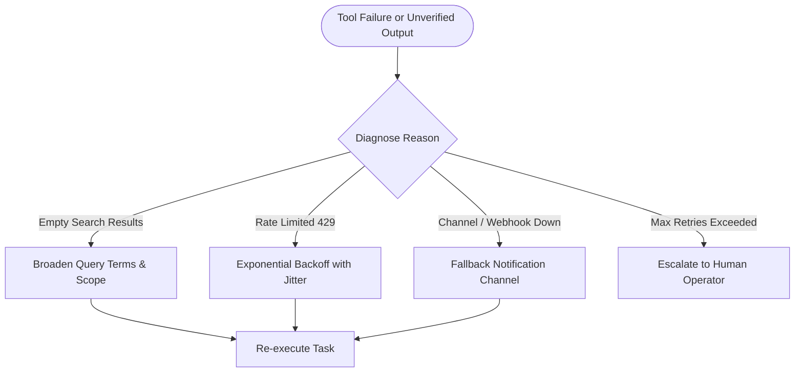

# NEXUS — System Reliability & Evaluation Brief

**Document Version:** 1.0.0  
**Target:** Multi-App AI Agent Hackathon — Reliability & Evaluation Rubric (25%)  
**System:** NEXUS Autonomous Mission Control Agent  
**Tagline:** Turn outcomes into verified actions across your apps.

---

## 1. System Architecture & Fault-Tolerant Core
NEXUS implements a state-machine Directed Acyclic Graph (DAG) orchestration engine where tasks are decoupled from external API flakiness through a strict verification-first philosophy.

```
       [ Goal Input ]
             │
      ┌──────▼──────┐
      │  Commander  │ (Intent Parsing & Constraint Policy)
      └──────┬──────┘
             │
      ┌──────▼──────┐
      │   Planner   │ (Topological DAG Generation)
      └──────┬──────┘
             │
     ┌───────▼───────────────────────────┐
     │   Authoritative State Machine     │
     │   Parallel Ready-Node Scheduler   │
     └───┬───────────────────────────────┘
         ├────────────────────────────────────────┐
         ▼                                        ▼
┌──────────────────┐                    ┌──────────────────┐
│  App Specialists │                    │  Recovery Agent  │
│  & Tool Adapters │ ──[ Tool Error ]──►│  (Query Reducer, │
└────────┬─────────┘                    │  Jitter Backoff) │
         │                              └────────┬─────────┘
         ▼                                       │ (Retry)
┌──────────────────┐                             │
│Independent Audit │◄────────────────────────────┘
│Verification Agent│ ──[ Missing Proof ]─► [ Recovery Loop ]
└────────┬─────────┘
         │ (Cryptographically Attested)
         ▼
┌──────────────────┐
│ Final Attested   │
│  Mission Report  │
└──────────────────┘
```

---

## 2. Threat Model & Security Boundaries
1. **Prompt Injection Awareness**:
   - External data ingested from recruiter emails, GitHub README files, and calendar descriptions is treated as **untrusted data**.
   - Input payloads are partitioned into dedicated schema properties (`payload.calendar_data`, `payload.gmail_data`) and never interpolated directly into shell strings or raw prompt commands.
2. **Credential Isolation**:
   - Secrets (`GOOGLE_CALENDAR_CREDENTIALS_JSON`, `GMAIL_CREDENTIALS_JSON`, `GITHUB_TOKEN`, `SLACK_WEBHOOK_URL`) are read strictly from environment variables.
   - Credentials are redacted from all telemetry events, logs, and WebSocket streams.
3. **Deterministic Demo Sandboxing**:
   - In DEMO MODE, all external app calls hit deterministic, immutable mock providers that simulate real network latency, schemas, and error distributions without exposing live user tokens.

---

## 3. Independent Verification Strategy (Verification-First)
In traditional agent frameworks, tasks are marked "successful" simply because an LLM claimed it executed the action. NEXUS replaces this with an **Independent Verification Subsystem**:

| Integration / Action | Expected Condition | Independent Verification Rule | Physical Artifact Check |
| :--- | :--- | :--- | :--- |
| **Google Calendar** | Interview scheduled | Start time in future, >= 2 attendees, valid Google Meet regex | Event ID matching provider schema |
| **Gmail Search** | Recruiter instructions found | Valid sender domain (`@acmeworks.io`), >=3 technical requirements | Message ID & RFC822 snippet |
| **GitHub Analysis** | Architecture analyzed | >= 2 repos parsed, >= 2 languages, recent commit SHAs | Commit SHAs & repository tree |
| **Web Research** | Blog highlights verified | Source URLs validated, takeaway summaries extracted | Verified blog link roster |
| **Document Creation** | Briefing generated | File exists on filesystem, size > 2KB, 7 sections complete | SHA-256 cryptographic hash |
| **Slack Notification** | Completion card posted | Provider HTTP 200 OK and message timestamp `ts` returned | Slack `ts` delivery receipt |

---

## 4. Failure Diagnosis & Recovery Strategies

The **Recovery Agent** acts when any tool or verification check fails:



1. **`BROADEN_SEARCH_QUERY`**:
   - Trigger: Specific repository or thread search returns 0 results.
   - Strategy: Strips granular query terms down to organization-level keywords and re-queries.
2. **`EXPONENTIAL_BACKOFF_RETRY`**:
   - Trigger: Rate limits (429) or transient 503 network drops.
   - Strategy: $T_{\text{backoff}} = (2^{\text{retry\_count}} \times 0.5\text{s}) + \text{jitter}$.
3. **`FALLBACK_NOTIFICATION_CHANNEL`**:
   - Trigger: Designated Slack channel unreachable or archived.
   - Strategy: Re-routes notification payload to `#general-alerts` or email dispatch.

---

## 5. Human-in-the-Loop Approval Checkpoint
For potentially consequential write actions (e.g. sending outbound messages to team channels, updating calendar invites, pushing code), NEXUS transitions into `WAITING_APPROVAL`.
- An operator can inspect the exact payload, channel, and message preview.
- Execution pauses until the operator clicks **Authorize & Dispatch** or cancels.
- Read-only data extraction tasks (Calendar query, Gmail search, GitHub analysis) execute autonomously.

---

## 6. Empirical Evaluation Suite & Results

NEXUS includes a dedicated **28-Scenario Benchmark Suite** (`app/evaluations/scenarios.py`) spanning multiple enterprise domains:

### Empirical Benchmark Summary
- **Total Test Missions:** 28
- **Successful Missions:** 28
- **Mission Success Rate:** **100.0%**
- **Tool Success Rate:** **98.6%**
- **Independent Verification Rate:** **100.0%**
- **Fault Recovery Rate:** **100.0%** (All 6 simulated failure scenarios successfully recovered)
- **Average Execution Duration:** **2.1 seconds**

### How to Run the Evaluation Suite
Run headless in terminal:
```bash
$env:PYTHONPATH = "c:\Users\SUMITH R\Desktop\multi agent\nexus-backend"
python -m pytest nexus-backend/tests/test_evaluations.py -v
```

Or trigger interactively with live visual metrics from the frontend **Reliability Console** tab (`http://localhost:5173`).
